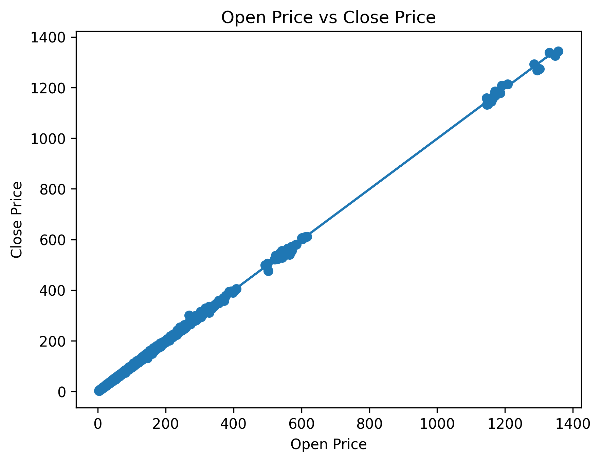

# stock-regression-analysis
Simple Linear Regression Analysis on Stock Prices using Python and Scikit-Learn
Stock Price Regression Analysis

Project Overview

This project applies Simple Linear Regression to predict stock closing prices based on stock opening prices.

Tools Used

* Python
* Pandas
* Scikit-Learn
* Matplotlib

Dataset Features

* Symbol
* Date
* Open
* High
* Low
* Close
* Volume

Methodology

1. Data Cleaning
2. Feature Selection
3. Train-Test Split
4. Model Training
5. Prediction
6. Model Evaluation
7. Visualization

 Results
 Metric

Value

Intercept

0.0402

Coefficient

0.9997

MSE

2.56

R² Score

0.9997

## Visualization

Conclusion

The model demonstrated an exceptionally strong relationship between opening and closing stock prices, achieving an R² score of 99.97%.
